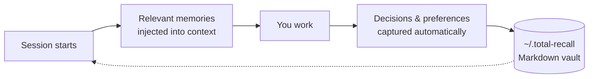
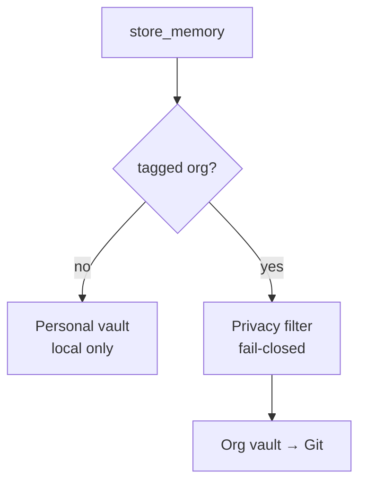

# 🧠 total-recall

**Your AI assistant forgets everything at the end of each session. This fixes that.**

A persistent, searchable memory for Claude Code and Gemini CLI. Memories are plain Markdown files on your disk — greppable, git-versionable, Obsidian-readable. Nothing leaves your machine unless you tag it `org`.



## ⚙️ How it works

| | |
|---|---|
| **17 MCP tools** | store, recall, hybrid search, semantic rerank, bulk export/import |
| **Hybrid search** | TF-IDF × Ebbinghaus forgetting curve, fused with vector embeddings |
| **Lifecycle hooks** | context injected at session start, memories captured as you work |
| **Two vaults** | personal stays local; `org`-tagged syncs to a shared Git repo |



C4 diagrams (context → containers → components → code), module map, data model,
boot sequence, search pipeline and hook lifecycle are documented in
**[ARCHITECTURE.md](plugins/total-recall/ARCHITECTURE.md)**.

## 💡 What gets saved automatically

Work observations (what worked, what didn't) · non-obvious project context
(motivations, constraints, non-trivial decisions) · an end-of-session
"anything worth remembering?" prompt.

Not saved: code snippets, file paths, git history — all derivable from the workspace.

## 🚀 Install

From inside a Claude Code session:

```
/plugin marketplace add adrian-balaban/total-recall
/plugin install total-recall
```

then `./install.sh` once, from the installed plugin directory, to create the
vaults and register the MCP server.

Linux · macOS · Windows (Git Bash) · Node.js 18+. Gemini CLI, local clones, and the
minimal (no-vector) profile: **[INSTALL.md](plugins/total-recall/INSTALL.md)**

**The marketplace is the only distribution channel** — no zip, no npm package. It
installs the `release` branch, whose bundle is built by GitHub Actions after the CI
gate goes green; `dist/` is gitignored on `main`, so no hand-built artifact can ship.

### 🔗 Footprint

Two production dependencies — the MCP SDK and Zod. Three optional ones power
semantic search (`@huggingface/transformers`, `better-sqlite3`, `sqlite-vec`)
and are only pulled in if you enable it.

| | |
|---|---|
| **Plugin** | ~1–2 MB |
| **Optional model** | ~200 MB, downloaded on first use |

## 🧭 Design principles

- **Local-first** — memories live on your machine, not in the cloud.
- **Readable** — every memory is a Markdown file you can edit in any editor.
- **Versionable** — the team vault is git-backed; the personal vault stays local.
- **No infrastructure** — no external server or database. The Markdown files are
  the source of truth; the vector index is a local SQLite, regenerable anytime.
- **Fault-tolerant** — degrades to text search if the vector path is unavailable.

## 📊 Status

| | |
|---|---|
| **Version** | 1.1.20 — stable |
| **Tests** | 744 unit + 20 integration passing · 45 files · ~13k lines of test code |
| **Coverage** | 93.6% statements · 88.2% branches · 95.3% lines |
| **Mutation** | 65.39% (Stryker, 16 core modules, measured in CI) · gate fails below 65% |
| **CI** | [`mutation.yml`](.github/workflows/mutation.yml) — audit + typecheck + build + Stryker on every push/PR to `main`. The only build pipeline; nothing is gated locally |
| **Releases** | [`release.yml`](.github/workflows/release.yml) — builds `dist/` and publishes the `release` branch the marketplace installs from; tags + notes when the version changes |
| **Audit** | 0 critical in production deps |

Reproduce: `npm test` · `npm run test:coverage` · `npm run test:integration` · `npm run mutation`
(from `plugins/total-recall/`)

### ⚠️ Known issues

- **Coverage misses three of four thresholds** set in `vitest.config.ts`: statements
  93.6% (need 95), functions 93.5% (need 95), branches 88.2% (need 90). Lines pass at
  95.3%. `npm run test:coverage` therefore exits non-zero. Largest gaps are
  `vectorStore.ts` (72.5%) and `embeddings.ts` (88.6%).
- **Mutation score has only 0.39 pts of headroom** over the 65% break threshold
  (65.39% as measured by [run 32400076703](https://github.com/adrian-balaban/total-recall/actions/runs/32400076703)).
  Any small drop in test strictness fails the gate — and since the gate is what
  publishes the `release` branch, a red gate silently leaves consumers on the
  previous build. Widening this margin is the next piece of work.

---

📄 **[Executive overview](EXECUTIVE-OVERVIEW.md)** — non-technical summary, tool
inventory, and how the design maps to the Thoughtworks Technology Radar Vol. 34
([🇷🇴 Romanian](EXECUTIVE-OVERVIEW-RO.md))

📖 **[Full documentation](plugins/total-recall/README.md)** ·
🏗️ **[Architecture](plugins/total-recall/ARCHITECTURE.md)** ·
📦 **[Install guide](plugins/total-recall/INSTALL.md)** ·
🎤 **[Talk: Claude vs Ollama & Total Recall](https://github.com/adrian-balaban/presentation-claude-vs-ollama-and-total-recall-plugin-21-07-2026)** (Romanian, Jul 2026)
