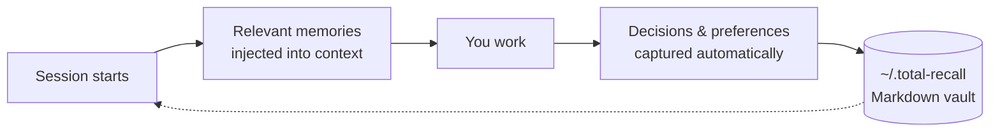
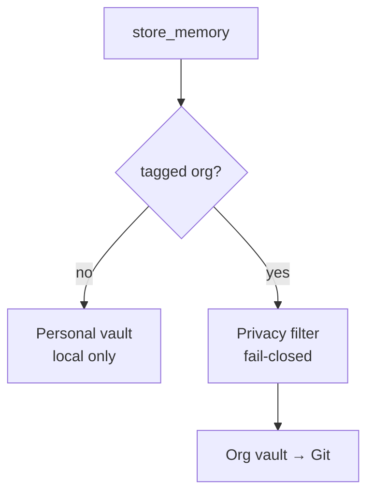

# 🧠 total-recall

**Your AI assistant forgets everything at the end of each session. This fixes that.**

A persistent, searchable memory for Claude Code and Gemini CLI. Memories are plain Markdown files on your disk — greppable, git-versionable, Obsidian-readable. Nothing leaves your machine unless you tag it `org`.



## 📊 Status

| | |
|---|---|
| **Unit tests** | 744 passing · 41 files |
| **Integration** | 20/20 passing |
| **Coverage** | 93.6% statements · 88.2% branches · 95.3% lines |
| **Mutation** | 65.9% · Stryker over 16 core modules · gate breaks below 65% |
| **Audit** | 0 critical in production deps |

Reproduce: `npm test` · `npm run test:coverage` · `npm run test:integration` · `npm run mutation`
(from `plugins/total-recall/`)

### ⚠️ Known issues

- **Coverage misses three of four thresholds** set in `vitest.config.ts`: statements
  93.6% (need 95), functions 93.5% (need 95), branches 88.2% (need 90). Lines pass at
  95.3%. `npm run test:coverage` therefore exits non-zero. Largest gaps are
  `vectorStore.ts` (72.5%) and `embeddings.ts` (88.6%).
- **Mutation score has only 0.9 pts of headroom** over the 65% break threshold, so a
  small drop in test strictness will fail the gate.

## 🚀 Install

From inside a Claude Code session:

```
/plugin marketplace add adrian-balaban/my-claude-plugins-marketplace
/plugin install total-recall
```

Linux · macOS · Windows (Git Bash). Gemini CLI, local clones, and the minimal
(no-vector) profile: **[INSTALL.md](plugins/total-recall/INSTALL.md)**

## ⚙️ How it works

| | |
|---|---|
| **17 MCP tools** | store, recall, hybrid search, semantic rerank, bulk export/import |
| **Hybrid search** | TF-IDF × Ebbinghaus forgetting curve, fused with vector embeddings |
| **Lifecycle hooks** | context injected at session start, memories captured as you work |
| **Two vaults** | personal stays local; `org`-tagged syncs to a shared Git repo |



Module map, data model, boot sequence, search pipeline and hook lifecycle are
documented in **[ARCHITECTURE.md](plugins/total-recall/ARCHITECTURE.md)**.

## 💡 What gets saved automatically

Work observations (what worked, what didn't) · non-obvious project context
(motivations, constraints, non-trivial decisions) · an end-of-session
"anything worth remembering?" prompt.

Not saved: code snippets, file paths, git history — all derivable from the workspace.

---

📖 **[Full documentation](plugins/total-recall/README.md)** ·
🏗️ **[Architecture](plugins/total-recall/ARCHITECTURE.md)** ·
🎤 **[Talk: Claude vs Ollama & Total Recall](https://github.com/adrian-balaban/presentation-claude-vs-ollama-and-total-recall-plugin-21-07-2026)** (Romanian, Jul 2026)
