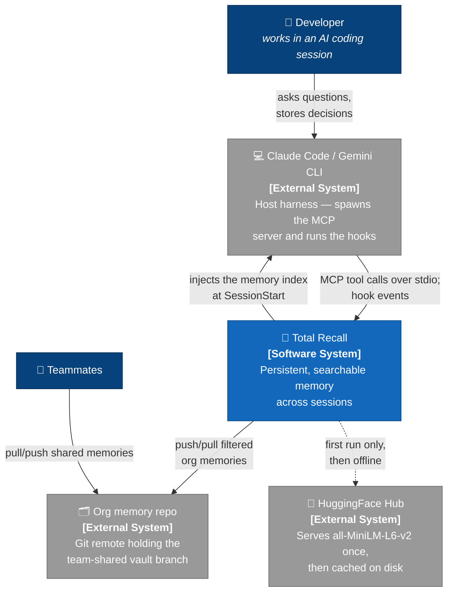
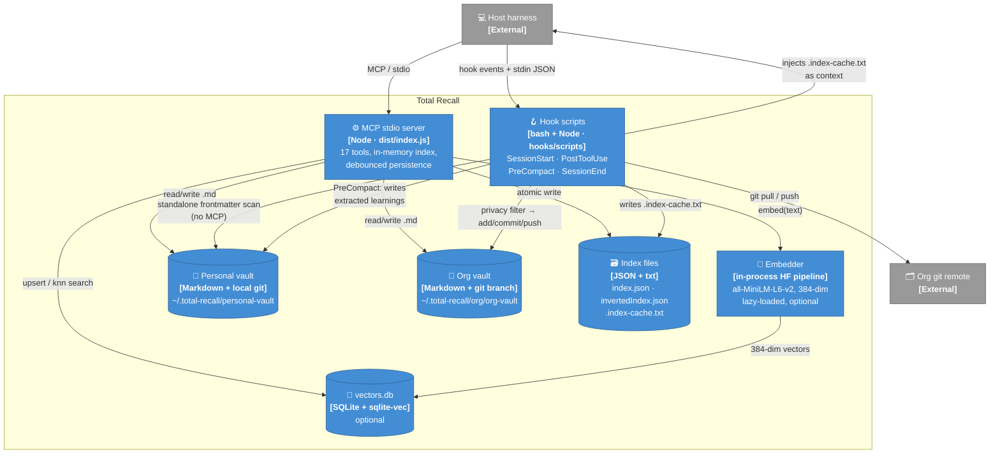
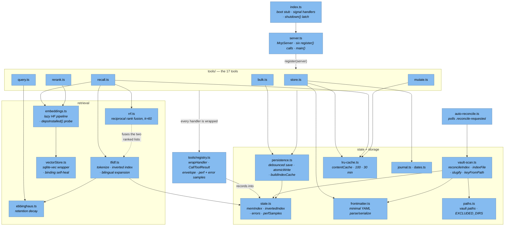
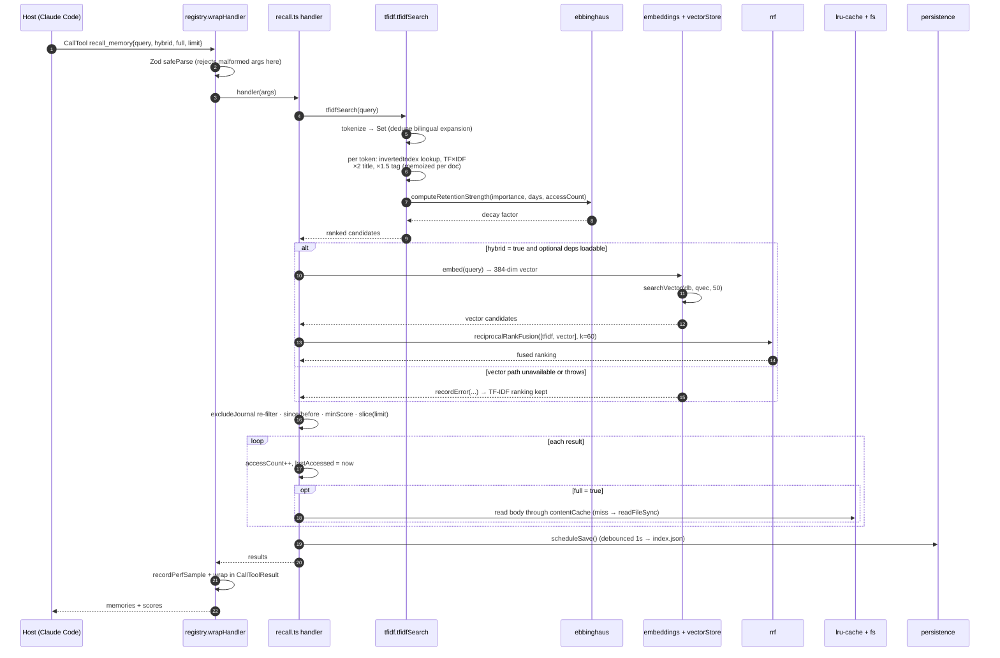

# 🏗️ Total-Recall — Architecture

## 📦 What it is

Total-recall is a plugin that gives the AI persistent, searchable memory across sessions. It runs as an MCP stdio server. The compiled entry point is `dist/index.js`; the source is TypeScript under `src/`.
Is compatible with Claude Code and Gemini CLI.
---

## 🧭 C4 Model

Four zoom levels over the same system, per Simon Brown's C4 model: context → containers → components → code.

### C1 — System Context

Who uses total-recall and what it talks to. The plugin never calls a hosted inference API: the only outbound network traffic is git (org vault) and a one-time model download.



### C2 — Containers

The system is not one process. A short-lived Node process serves MCP tools; separate shell/Node scripts run on harness hook events; state lives in plain files. Note the two writers of `.index-cache.txt`: the MCP server (debounced) and `build-memory-index.sh` (a standalone bash scan that needs no running server).



### C3 — Components (inside the MCP stdio server)

`server.ts` owns no schemas and no dispatch table: each `tools/*.ts` module co-locates its Zod shape, handler and `register(server)`, and `registry.ts`'s `wrapHandler` adds the result envelope plus perf/error instrumentation. Everything reads the index through the single `state.ts` singleton.



### C4 — Code: `recall_memory` hybrid path

The lowest zoom level, showing the actual call order for one tool. The vector branch is best-effort: any failure there (embed, sqlite-vec, fusion) is recorded via `recordError` and the result degrades to the TF-IDF ranking instead of throwing.



---

## 🗺️ Module Map

```
src/
├── index.ts          boot stub — signal handlers + calls main()
├── server.ts         McpServer construction; six register() calls wire the 17 tools (schemas co-located in tools/*.ts); main()
├── state.ts          shared in-memory singletons (memIndex, invertedIndex, errors, perfSamples)
├── paths.ts          vault/DB/index file paths, EXCLUDED_DIRS, DEFAULT_CATEGORIES, ensureDir
├── types.ts          MemoryFrontmatter, MemoryMetadata, Index, InvertedIndex
├── lru-cache.ts      LRUCache class + shared contentCache instance (100 entries, 30 min TTL)
├── persistence.ts    loadIndexes, debounced scheduleSave/scheduleIdfRecalc, saveNow, flushPending, buildIndexCache
├── frontmatter.ts    minimal YAML frontmatter parser/serializer (replaces gray-matter)
├── vault-scan.ts     reconcileIndex, indexFile, deriveCategory, slugify, keyFromPath, tokenEstimate
├── tfidf.ts          tokenize, rebuildInvertedIndex, tfidfSearch
├── ebbinghaus.ts     computeRetentionStrength, daysSince
├── rrf.ts            reciprocalRankFusion (k=60)
├── embeddings.ts     embeddings: in-process HuggingFace pipeline (all-MiniLM-L6-v2, 384-dim); lazy-loaded + no-op if deps absent; failed load is not cached (retried next call); depsInstalled() capability probe (are @huggingface/transformers + sqlite-vec + the better-sqlite3 native binding all loadable) so get_stats reports vector search enabled on a fresh session before the lazy load fires
├── vectorStore.ts    sqlite-vec upsert/search/delete wrapper
├── dates.ts          parseRelativeDate
├── journal.ts        appendJournal
├── auto-reconcile.ts polls the .reconcile-requested marker (dropped by pull-org-vault.sh) → reconcileIndex
├── privacy-filter.ts SECRET_TOKEN_RE + email + validated CC (Luhn) / IBAN (mod-97) / formatted-phone checks — fail-closed gate for org sync
└── tools/
    ├── store.ts      store_memory
    ├── recall.ts     recall_memory, search_index
    ├── rerank.ts     rerank_memories
    ├── query.ts      list_memories, get_memories_by_keys, get_stats, get_timeline, get_related_memories, prune_memories
    ├── mutate.ts     update_memory, delete_memory, rebuild_index, confirm_memory
    └── bulk.ts       export_memories, import_memories, delete_memories
```

---

## 🧬 Data Model

### On-disk format

Each memory is a Markdown file with a YAML frontmatter block:

```
~/.total-recall/
├── index.json               — flat Record<key, MemoryMetadata> (primary index)
├── invertedIndex.json       — TF-IDF inverted index Record<token, {docs, idf}>
├── .index-cache.txt         — shell-readable summary injected at SessionStart
├── personal-vault/
│   ├── <category>/
│   │   └── <slug>.md        — personal memory files
│   └── vectors.db           — sqlite-vec embeddings (optional)
└── org/
    └── org-vault/
        └── <category>/
            └── <slug>.md    — shared/org memory files
```

### Frontmatter schema (`MemoryFrontmatter`)

| Field | Type | Notes |
|---|---|---|
| `title` | string | required |
| `tags` | string[] | `org` routes to org vault |
| `author` | string | OS username; org writes are author-protected |
| `sessions` | string[] | session IDs, capped at 50 |
| `created` | ISO string | preserved across `force` overwrites |
| `updated` | ISO string | set on every write |
| `importanceScore` | 0–1 | 0.5 default; drives Ebbinghaus decay rate |

### In-memory index (`MemoryMetadata`)

Extends frontmatter with runtime stats: `key`, `filePath`, `category`, `contentPreview` (first 500 chars of body), `accessCount`, `lastAccessed`, `tokenEstimate`, `isOrg`, `mtimeMs`/`size` (filesystem identity of the last-indexed body — `reconcileIndex` compares these against the current `lstatSync` to skip `readFileSync`+`parseFrontmatter` for unchanged files; filesystem-local, so the skip helps same-machine session-to-session boots, not after a `git pull` which changes mtime).

### Key derivation

```
personal: path relative to PERSONAL_VAULT, extension stripped
          e.g.  knowledge/my-decision.md  →  knowledge/my-decision
org:      same but prefixed with "org/"
          e.g.  org/architecture/db-choice.md  →  org/architecture/db-choice
```

---

## 🚀 Boot Sequence

```
main()
 ├─ ensureDir(PERSONAL_VAULT, ORG_VAULT)
 ├─ ensureDir(<PERSONAL_VAULT>/<each DEFAULT_CATEGORIES>)
 ├─ loadIndexes()        ← reads index.json ONLY into memIndex (#18: invertedIndex.json
 │                        is no longer loaded — a dead read, since the immediately-
 │                        following recalcIdfNow rebuilds it from memIndex and main()
 │                        is synchronous until server.connect, so nothing can read it
 │                        in between)
 ├─ reconcileIndex()     ← always; full vault scan, preserves accessCount/lastAccessed;
 │                        skips readFileSync+parseFrontmatter for files whose
 │                        mtimeMs+size match the cached entry (#19)
 ├─ recalcIdfNow()       ← synchronous rebuild + persist of invertedIndex.json + .index-cache.txt
 ├─ scheduleSave()       ← debounced 1s → index.json write
 ├─ markIndexFresh()     ← clear dirtyTokens so the boot timer skips the +2s IDF recalc
 │                        (recalcIdfNow already did it; tokens did not change in between)
 └─ server.connect(StdioServerTransport)
```

On `SIGTERM` / `SIGINT` / stdin `end`/`close` / `beforeExit`: `shutdown()` runs `flushPending()` (synchronous index write) → `await flushEmbeddings()` (drain in-flight embed→upsert) → `process.exit(0)`. `shutdown()` is **idempotent via a module-level `shuttingDown` latch** — the four triggers can fire concurrently (SIGTERM-while-stdin-closing, a double signal), and the latch makes the second-and-later call a no-op so the flush completes exactly once. `beforeExit` only calls `flushPending()` (no embedding drain, no exit). Pinned structurally by `index-stdin-end.test.ts` and dynamically by `src/__tests__/integration/shutdown-sigterm.integration.test.ts` (spawns real `dist/index.js`, SIGTERMs mid-session before the 1s debounce, asserts the stored key lands in `index.json` on disk before exit).

---

## 🛠️ The 17 MCP Tools

### Write
| Tool | Description |
|---|---|
| `store_memory` | Create a new memory; routes to org vault if tagged `org`; `force=true` overwrites |
| `update_memory` | Patch title/content/tags/importanceScore; author-protected for org |
| `delete_memory` | Remove file + index entry + vector; invalidates LRU |
| `confirm_memory` | Increment confirmations/flags to guide retention |

### Bulk
| Tool | Description |
|---|---|
| `export_memories` | Dump selected memories (with full content) for backup/transfer. Returns `{count, memories, errors}`; an unreadable body becomes an `{key, error}` entry in `errors` (never a silent `content: ''`, which a `force` import would clobber real content with) |
| `import_memories` | Restore memories from an export archive; preserves key/timestamps/sessions. Skips any entry carrying an `error` field so a failed export read can't overwrite a live memory |
| `delete_memories` | Batch delete; `confirm=true` required (no default — required + `true`). A reserved (`no-prune` without `force`) key is recorded as a per-key error, not a batch reject — the rest of the batch proceeds |

### Search / Read
| Tool | Description |
|---|---|
| `recall_memory` | TF-IDF + Ebbinghaus, optionally fused with vector search via RRF |
| `search_index` | Metadata-only TF-IDF (no file reads, no accessCount bump) |
| `get_memories_by_keys` | Direct key lookup; reads through LRU cache |
| `rerank_memories` | Re-rank a candidate list by cosine similarity to a query, using local embeddings (no LLM call) |

### List / Query
| Tool | Description |
|---|---|
| `list_memories` | Paginated metadata listing with category/tag filter |
| `get_related_memories` | Jaccard tag similarity + same-category boost (0.2); requires ≥1 shared tag |
| `get_timeline` | Memories in date range, ordered by `updated` |
| `get_stats` | Total + by-category counts, cache stats, perf percentiles, recent errors, and a `vector` block (`enabled` / `depsPresent` / live `model` / stored model+dim); `enabled` defaults to true when the optional deps are loadable (via `depsInstalled()`), so a fresh session reports vector search on before the lazy embedder load fires — back-compat `vectorSearchEnabled` alias mirrors `enabled` |

### Maintenance
| Tool | Description |
|---|---|
| `rebuild_index` | `reconcileIndex()` + rebuild TF-IDF; preserves `accessCount`/`lastAccessed` |
| `prune_memories` | **List** low-retention candidates (Ebbinghaus strength < threshold); does NOT delete |

---

## 🔀 Dual Vault Routing

```
store_memory(tags=[...])
       │
       ├── contains "org"  ──►  ORG_VAULT  (~/.total-recall/org/org-vault/)
       │                        key prefix: "org/"
       │                        author-protected writes
       │                        synced to git repo via PostToolUse hook
       │
       └── otherwise       ──►  PERSONAL_VAULT  (~/.total-recall/personal-vault/)
                                key: plain relative path
                                journal entry appended on store
```

`personal` and `org` tags are mutually exclusive — `store_memory` throws if both are present.

---

## ✍️ Write Path (`store_memory`)

```
store_memory(title, content, tags, category, importanceScore, ...)
 │
 ├─ slugify(title) → slug
 ├─ resolve filePath: <vault>/<category>/<slug>.md
 ├─ if file exists:
 │    ├─ author-guard (org only)
 │    └─ if !force → throw duplicate error
 ├─ withExecutiveSummary(content)   ← idempotent header injection
 ├─ stringifyFrontmatter(body, fm)  ← custom YAML serializer
 ├─ fs.writeFileSync(filePath)      ← synchronous, always durable
 ├─ memIndex[key] = { ...meta }
 ├─ contentCache.set(key, body)
 ├─ if !isOrg → appendJournal('store', key, title)
 ├─ scheduleSave()                  ← debounced 1s
 └─ embed(content).then(vec → upsertVector(...))   ← async, fire-and-forget
```

---

## 🔍 Search Pipeline (`recall_memory`)

```
query
  │
  ├─ tfidfSearch(query)
  │    ├─ tokenize(query) → tokens
  │    ├─ for each token: invertedIndex lookup
  │    ├─ score = TF × IDF × title-boost(2×) × tag-boost(1.5×)
  │    └─ × computeRetentionStrength(importance, daysSince, accessCount)
  │              └─ strength = min(1, importance × exp(-λ×days) × (1 + accessCount×0.2))
  │                            where λ = 0.16 × (1 − importance×0.8)
  │
  ├─ [optional hybrid path, if hybrid=true and deps installed]
  │    ├─ embed(query) → query vector
  │    ├─ searchVector(db, qvec, 50) → vector results
  │    └─ reciprocalRankFusion([tfidfResults, vecResults], k=60)
  │              └─ score(d) = Σ 1/(60 + rank(d))  across both lists
  │
  ├─ if excludeJournal → re-filter journal entries
  │    (hybrid fusion can surface them via the vector rank even when tfidfSearch excluded them)
  ├─ filter by `since` / `before` date (optional; `before` is an exclusive upper bound,
  │    combinable with `since` for a date range)
  ├─ filter by `minScore` (optional floor; default 0 = no filtering. Scores are NOT
  │    comparable across hybrid modes — RRF-fused scores are tiny, raw TF-IDF larger;
  │    use hybrid=false for a predictable threshold scale)
  ├─ slice to `limit`
  └─ for each result:
       ├─ meta.accessCount++; meta.lastAccessed = now
       ├─ scheduleSave()
       └─ if full=true → read file through LRU cache → return with content
          else         → return metadata + score only
```

### Ebbinghaus Decay

The retention strength formula models the forgetting curve:

```
λ     = 0.16 × (1 − importance × 0.8)     # high-importance memories decay slower
decay = clamp(importance × exp(−λ × daysSince)
              × (1 + accessCount × 0.2 + confirmations × 0.1 − flags × 0.1), 0, 1)
```

A memory with `importanceScore=1.0` has `λ=0.032` (slow decay); one with `importanceScore=0.3` has `λ=0.122` (fast decay). Each access adds 20% strength on top; each `confirm_memory` confirmation adds 10% and each flag subtracts 10% — a frequently accessed memory that was flagged as wrong no longer stays on top.

---

## 💾 Persistence & Debounce

All writes go to disk synchronously for the `.md` file but debounce the index:

```
any write operation
       │
       └─ scheduleSave()
              └─ setTimeout(1s) → writeFileSync(index.json)
                     └─ scheduleIdfRecalc()
                            └─ setTimeout(2s) → rebuildInvertedIndex()
                                              → writeFileSync(invertedIndex.json)
                                              → buildIndexCache()  (.index-cache.txt)
```

`flushPending()` (called on SIGTERM/exit) cancels pending timers and runs both synchronously so no debounced write is lost when the MCP client disconnects.

**Single-writer assumption (cross-process caveat).** `index.json` is file-backed shared state with no file lock / CAS. Each Claude Code window spawns its own total-recall stdio process; both load `memIndex` at boot, mutate in memory, and `flushPending` via `atomicWrite` (write-`.tmp` + rename) on exit. Last rename wins; an earlier process's flush is silently discarded. The disk-durable fields (`title`, `tags`, `content`, `sessions` — `sessions` is written to frontmatter by `mutate.ts` and read back by `reconcileIndex`) are re-derived from the `.md` files on the next boot, so a clobbered `index.json` does not lose them. The fields genuinely at risk are the runtime-only `accessCount` / `lastAccessed` (soft Ebbinghaus-retention signals not stored in frontmatter) — a concurrent-session clobber resets those to whatever the last writer had in memory. Impact is limited to retention-decay accuracy, not memory content. A real fix would persist `accessCount`/`lastAccessed` into `.md` frontmatter on flush or guard `index.json` writes with a `flock`; neither is implemented today.

---

## ⚡ LRU Content Cache

`contentCache` (in `lru-cache.ts`) keeps the last 100 memory bodies in memory for 30 minutes, keyed by memory key. It is:

- **Populated** by `store_memory` (after a write) and on first cache-miss in `recall_memory(full=true)` / `get_memories_by_keys`
- **Invalidated** by `update_memory` and `delete_memory`
- **Not consulted** by `search_index` (metadata-only, never reads files)

The LRU eviction is O(1) via a `Map` whose insertion order tracks recency.

---

## 📄 Frontmatter Parser

`src/frontmatter.ts` is a purpose-built replacement for `gray-matter` (which depended on EOL `js-yaml 3.x`, CVE GHSA-h67p-54hq-rp68). It handles only what total-recall writes:

- Inline arrays: `tags: [a, b, "c d"]`
- Block arrays: `tags:\n  - a\n  - b`
- Quoted strings (single and double), bare strings, numbers, booleans
- Immune to YAML merge-key DoS by design (no arbitrary YAML)

`withExecutiveSummary(content)` is idempotent: it prepends `## Executive Summary` only if the body doesn't already start with it.

---

## 🪝 Hook Lifecycle

Hooks are declared in `hooks/hooks.json` and executed by the Claude Code harness.

### `SessionStart` (4 steps, sequential)

```
1. pull-org-vault.sh       — git pull on org vault branch (if configured)
2. build-memory-index.sh   — standalone bash scan of frontmatter → .index-cache.txt (no MCP)
3. load-memory-index.sh    — cat .index-cache.txt → injected into context
4. check-sync-errors.sh    — warn if org-sync pushes failed since the last success marker
```

> **`hookEventName` is required.** Steps 1/3 that inject context emit
> `{"hookSpecificOutput":{"hookEventName":"SessionStart","additionalContext":…}}`.
> Claude Code **drops** `additionalContext` whose `hookSpecificOutput` lacks
> `hookEventName`, so omitting it silently breaks context injection. JSON-encoding
> uses `node` (the plugin's hard dependency), not `python3`.

### `PostToolUse` (matcher: `mcp__plugin_total-recall_total-recall__(store_memory|update_memory|delete_memory)`)

```
sync-org-memory.sh  — fires on EVERY store/update/delete (the matcher triggers it
                       unconditionally); delegates the `org`-tag gate to the .mjs:
                       apply privacy filter → git add/commit/push org-vault branch
                     — also re-runs build-memory-index.sh to refresh .index-cache.txt
```

> **Matcher must stay a regex.** Claude Code evaluates a matcher with only
> `[a-zA-Z0-9_- ,|]` as an exact-string list compared against the full tool name
> (`mcp__plugin_total-recall_total-recall__<tool>`); a bare
> `store_memory|update_memory|delete_memory` never matches and the hook silently
> never fires. The parens force the unanchored-regex path. Pinned by
> `src/__tests__/hooks-matcher.test.ts`.

### `PreCompact`

```
extract-and-store-memories.sh
  ├─ reads transcript_path from the hook's stdin JSON (common hook input)
  ├─ asks Claude to extract 0–3 key learnings as JSON lines
  └─ pipes to store-learning.mjs
       └─ writes .md files directly to personal-vault (no MCP round-trip)
            └─ never overwrites existing files
            └─ skips lines whose title/tags contain a newline (frontmatter-injection guard)
```

> **Note:** `transcript_path` comes from Claude Code's stdin JSON payload — it is **not** a `CLAUDE_TRANSCRIPT_PATH` env var. An earlier version read that (never-set) env var, making PreCompact a silent no-op.

### `SessionEnd`

```
session-end.sh  — logs the session and flushes pending embedding writes before exit
```

---

## 🔐 Org Vault Sync & Privacy Filter

`scripts/sync-org-memory.mjs` runs after every org write. Before pushing it applies a fail-closed privacy filter that blocks:

- Secret-looking tokens (high-entropy strings, `key=value` patterns)
- All email addresses (unless the domain is in `allowedEmailDomains` in `~/.total-recall/config.json`)
- Credit cards (13–19 digit runs passing the Luhn checksum), IBANs (ISO 13616 mod-97), and formatted phone numbers — re-added in 7.3 in validated, low-FP form after the naive regexes were removed

Personal pronouns were intentionally removed from the filter: they had a false-positive rate high enough to block legitimate org memories (pronoun titles like "We are migrating…"). Phone numbers, credit cards, and IBANs were also removed initially — a bare 10-digit phone regex tripped on unix timestamps, AWS account ids, and git SHA fragments — but were RE-ADDED in 7.3 with validated detectors (Luhn for CC, mod-97 for IBAN, formatted-only shape for phone) that reject ~90% of random digit runs. The real "this is personal, don't sync" guard remains the mutual-exclusion of the `personal` and `org` tags enforced in the sync script.

Configuration in `~/.total-recall/config.json`:

```json
{
  "orgRepo": "git@github.com:org/memories.git",
  "allowedEmailDomains": ["mycompany.com"]
}
```

---

## ⚖️ Key Invariants

| Invariant | Where enforced |
|---|---|
| Exactly one `memIndex` object across the process | `state.ts` — all modules import from here |
| `.md` file always written before index update | `store.ts` — `writeFileSync` then `scheduleSave` |
| `accessCount`/`lastAccessed` survive `rebuild_index` | `vault-scan.ts` — `reconcileIndex` copies from existing entry |
| `org` + `personal` tags are mutually exclusive | `store.ts` — throws early |
| Org writes are author-protected (even `force=true`) | `store.ts` — checks `existingFm.author !== effectiveAuthor` |
| `journal` entries written only on `store_memory`, personal only | `store.ts` — `if (!isOrg) appendJournal(...)` |
| `sessions` capped at 50, deduplicated | `mutate.ts` — `update_memory` |
| Optional deps (`@huggingface/transformers`, `sqlite-vec`, `better-sqlite3`) never bundled | `tsconfig.json` + esbuild `--external` |
| `category` cannot escape its vault (path-traversal containment) | `store.ts` — resolves `<vault>/<category>` and rejects if it falls outside the vault root; the guard runs **before** `ensureDir`, so a traversal `category` cannot even create a stray directory outside the vault |
| Org-author guard ignores any caller-supplied `author` | `store.ts` — `effectiveAuthor = os.userInfo().username` for org; the `author` arg is ignored for org memories, so `force=true` cannot impersonate another author |
| Index files written atomically (write-`.tmp` + rename) | `persistence.ts` — `atomicWrite()` for `index.json`, `invertedIndex.json`, `.index-cache.txt`; no partial/truncated index on crash |
| Frontmatter scalars reject embedded newlines | `frontmatter.ts` — `serializeArrayItem`/`serializeString` throw on `/[\r\n]/`; prevents a newline in `title`/`tags` from injecting a new frontmatter key |
| `hookSpecificOutput.additionalContext` requires `hookEventName` | `load-memory-index.sh` — Claude Code drops `additionalContext` whose `hookSpecificOutput` lacks `hookEventName:"SessionStart"` |
| PreCompact reads `transcript_path` from stdin JSON, not an env var | `extract-and-store-memories.sh` — parses the hook's stdin JSON payload (Claude Code common hook input) |
| Frontmatter keys escaped before RegExp interpolation | `frontmatter.ts` — `escapeRegExp(k)`/`escapeRegExp(key)` at both `new RegExp` sites; a key is a literal string (any `[^:\s]+`, incl. metacharacters from a crafted/teammate-pushed org-vault memory), so it must match literally — without escaping a key like `(a+)+` is mis-matched and an explicit `(a+)+: []` array is wrongly dropped |
| `shutdown()` runs exactly once across concurrent exit triggers | `index.ts` — module-level `shuttingDown` latch; SIGTERM/SIGINT/stdin-end/stdin-close all route to one `shutdown()` whose first line short-circuits a second call. `flushPending` → `flushEmbeddings` → `process.exit(0)` completes once |
| `export_memories` never emits a silent `''` for an unreadable body | `bulk.ts` — null read → `{key, error}` entry + `errors` count; `import_memories` skips `error` entries, so a failed read can't clobber real content on a `force` import |
| `delete_memories` records a reserved key per-key, not batch-reject | `bulk.ts` — no up-front reserved-key throw; the per-key `deleteMemory` catch records it in `errors` and the batch continues |
| `rerank_memories` keys capped at 200 | `rerank.ts` — `MAX_KEYS=200` + schema `maxItems: 200`; extras sliced off the front (order preserved) before embed/score |
